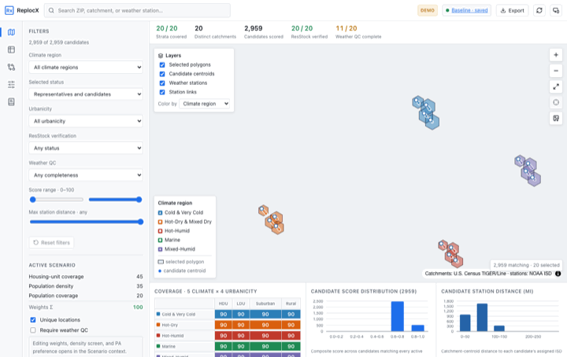
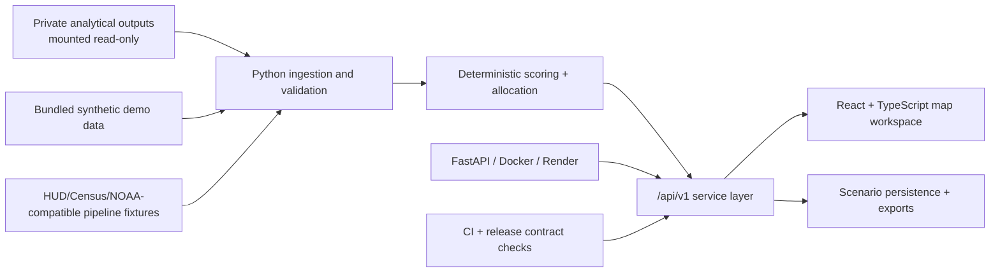

# ReplocX

[](https://github.com/hampochimacyril/Location-representation-explorer/actions/workflows/ci.yml)

ReplocX is a public-safe demonstration and private-production-ready decision
support application for selecting representative U.S. locations for national
building-stock, climate, and heat-health simulation workflows.

The project converts a difficult research operations problem into a transparent,
inspectable web application: deterministic scoring, representative-location
allocation, ZIP-code explanation, weather-station quality checks, scenario
comparison, exportable results, health checks, private-auth deployment controls,
and a polished React map workspace.

The public demo uses synthetic/demo data only. The private production profile can
mount real analytical outputs behind authentication without changing the product
surface.

## Professional Statement

ReplocX shows my ability to turn research-grade analytical methods into a
production-minded, user-facing product. It combines geospatial reasoning,
statistical representation, frontend design, backend API architecture, data
governance, deployment readiness, and rigorous release validation. The result is
not just a dashboard: it is a repeatable decision system that helps technical
teams explain why locations were selected, compare alternatives, and safely
separate public demo assets from private analytical data.

## Demo Media

### Animated GIF Preview



### Screenshots

| Overview | ZIP Explorer | Scenario Builder |
| --- | --- | --- |
|  |  |  |

### Demo Videos

- [Application workflow demo](docs/demo/representative-location-explorer-demo.webm)
- [Motion-graphics promo video](marketing/promo.mp4)
- Live public demo: [https://replocx.onrender.com](https://replocx.onrender.com)

The public media above uses the bundled synthetic demonstration dataset and is
safe for public portfolio review. Local narrated marketing exports are ignored
unless intentionally reviewed and staged.

## Outcome Snapshot

| Area | Result |
| --- | --- |
| Product surface | React + TypeScript + Vite map workspace |
| Backend | Python HTTP server plus FastAPI deployment entry point |
| Data mode separation | Public demo data by default; private mounted data by explicit env var |
| Representative coverage | 20 climate-region by urbanicity strata |
| Candidate universe | Demo: 2,959 candidates; committed national output: 4,019 candidates |
| API contract | `/api/v1` endpoints, OpenAPI schema, health/readiness, JSON errors |
| Scenario workflow | Configurable weights, uniqueness rules, density screen, weather-QC controls, saved scenarios |
| Security posture | Same-origin CSP/security headers, optional bearer-token private mode, no token persistence in browser storage |
| Release gates | Backend unit tests, frontend type/lint/unit/build, Playwright e2e, Docker smoke, release contract checks |
| Deployment | Public Render demo profile and separate private-production template |

## What This Showcases

- **Product engineering:** a full-stack research application with a polished,
  map-first workflow rather than a one-off notebook.
- **Data systems thinking:** clear boundaries between raw/private inputs,
  committed reproducible outputs, demo fixtures, manifests, and exports.
- **Geospatial reasoning:** ZIP-to-ZCTA/county/CBSA interpretation,
  catchments, weather-station assignment, and boundary-aware filtering.
- **Decision transparency:** every selected location is explainable through
  scores, strata, alternatives, substitution reasons, and methodology views.
- **Frontend craft:** keyboard-accessible React interface with map, ranking,
  scenario, comparison, detail-drawer, methodology, and export workflows.
- **Backend discipline:** API versioning, OpenAPI, health probes, graceful
  degraded mode, SQLite scenario persistence, structured logs, and auth hooks.
- **Release maturity:** CI gates, release-readiness audit, deployment records,
  privacy rules, and demo/prod separation.

## Architecture



## Current Capabilities

- Overview dashboard for 20 climate-region by urbanicity strata.
- Interactive target-catchment and weather-station map.
- ZIP-code explorer with ZCTA, county, CBSA, uncertainty, and filter-scope
  context.
- Configurable density screen, score weights, uniqueness rule,
  station-distance rules, weather-QC eligibility, and editable research-priority
  override.
- Candidate ranking table with filters, keyboard-operable sorting, CSV export,
  comparison, and scatter plot.
- Allocation comparison with score differences, substitution reasons, and
  coverage-efficiency diagnostics.
- Exact baseline ResStock filter fields and enumeration-verified values.
- Versioned scenario JSON and site-list CSV exports.
- Read-only ingestion manifest with SHA-256 fingerprints.
- Fault-tolerant startup with `/api/v1/health` readiness and same-origin
  security headers.
- `/api/v1` endpoints with OpenAPI schema, SQLite scenario persistence,
  optional private auth, and structured logs.
- Accessible UI: keyboard navigation, visible focus, `aria-sort`,
  reduced-motion support, and a print stylesheet.

## Repository Map

| Path | Purpose |
| --- | --- |
| `frontend/` | React + TypeScript + Vite application |
| `backend/` | API, service layer, exports, auth, persistence, observability |
| `pipeline/` | Data preparation, classification, validation, weather QC, provenance |
| `data/demo/` | Synthetic public-safe dataset for clones, CI, and public demo |
| `docs/screenshots/` | Public-safe app screenshots |
| `docs/demo/` | Public-safe demo scenes, GIF, storyboard, and WebM workflow video |
| `marketing/` | Public-safe promo source and tracked promo video |
| `tests/` | Backend, pipeline, release-contract, and fixture tests |
| `docs/` | Methodology, runbooks, deployment records, privacy rules, release readiness |

## Data Boundaries

ReplocX is designed around a strict public/private split.

- The public demo uses synthetic data in `data/demo/`.
- The committed pipeline outputs are reproducible app-ready artifacts, not raw
  private source data.
- Real analytical outputs should be mounted read-only with
  `RLE_ANALYSIS_DATA_DIR`.
- Private deployments should set `RLE_PRIVATE_AUTH_TOKEN`.
- Local credential documents, `.env.live`, raw data, generated manifests,
  SQLite private state, spreadsheets, and archives are ignored.

The application does not treat ZIP codes, ZCTAs, counties, CBSAs, places, and
weather stations as interchangeable. The ZIP explorer exists to expose those
distinctions clearly.

## Run Locally

Build the frontend once, then run the Python server:

```bash
npm --prefix frontend ci
npm --prefix frontend run build
python3 -m backend.server
```

Open [http://127.0.0.1:8787](http://127.0.0.1:8787).

For live frontend development:

```bash
python3 -m backend.server
npm --prefix frontend run dev
```

The Vite app runs on [http://127.0.0.1:5173](http://127.0.0.1:5173) and proxies
`/api` to the backend.

## Health, API, And Private Mode

Readiness:

```bash
curl http://127.0.0.1:8787/api/v1/health
```

OpenAPI:

```bash
curl http://127.0.0.1:8787/api/v1/openapi.json
```

Set `RLE_PRIVATE_AUTH_TOKEN` to require `Authorization: Bearer ...` or
`X-RLE-Auth` on non-public routes. The React app prompts on the first protected
response and keeps the token in memory only for the session.

## Test

Backend and pipeline:

```bash
python3 -m unittest discover -s tests -v
python3 -m py_compile backend/*.py scripts/*.py tests/*.py
```

Frontend:

```bash
npm --prefix frontend ci
npm --prefix frontend run typecheck
npm --prefix frontend run lint
npm --prefix frontend run test
npm --prefix frontend run build
```

End-to-end:

```bash
npm install
npm --prefix frontend run build
npm run test:e2e
```

Full release matrix:

```bash
scripts/verify_all.sh
```

## Public Demo Deployment

The bundled `render.yaml` deploys a public, demo-data instance. It never serves
private analytical outputs.

1. Connect the repository in Render as a Blueprint.
2. Accept `render.yaml`.
3. Confirm `/api/v1/health` returns `data_mode: demo`.

Verified demo: [https://replocx.onrender.com](https://replocx.onrender.com),
verified June 8, 2026. On the free tier, first request after idle can cold-start.

For a private real-data deployment, use `render.private.example.yaml`, mount real
processed outputs read-only, and set private auth/secrets in the host dashboard.

## Public Release Checklist

Before publishing or mirroring any public version:

- Confirm `git status --short` does not include `.env.live`, `*.docx`, raw data,
  local narrated exports, private SQLite files, or generated manifests.
- Review screenshots and videos for restricted data, local paths, or identifying
  details.
- Keep public demo deployments on synthetic data.
- Do not commit secret values; use `.env.example` and host secret managers.
- Run `scripts/verify_all.sh` or the closest available CI matrix.

See `docs/privacy_and_repository_rules.md` for repository handling rules.

## Refresh Demo Media

Capture the latest source UI and rebuild the README GIF:

```bash
node scripts/capture_current_demo_media.mjs
python3 scripts/build_demo_gif.py
node scripts/render_demo_webm.mjs
```

The capture script starts the backend and Vite source app locally, screenshots
the current routes, updates `docs/demo/scenes/` and `docs/screenshots/`, the GIF
builder turns those fresh scenes into `docs/demo/replocx-demo.gif`, and the WebM
renderer rebuilds `docs/demo/representative-location-explorer-demo.webm`.

## Start Reading

- Methodology: `docs/methodology.md`
- User guide: `docs/user_guide.md`
- Release readiness: `docs/RELEASE_READINESS.md`
- Deployment record: `docs/DEPLOYMENT_RECORD.md`
- Operations runbook: `docs/OPERATIONS_RUNBOOK.md`
- Marketing assets: `marketing/README.md`
