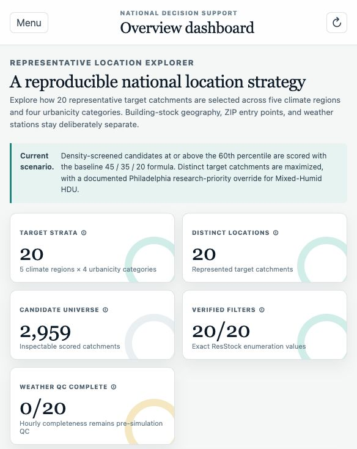
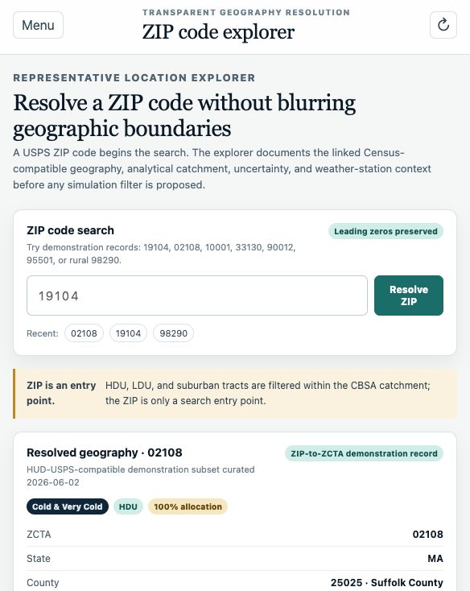
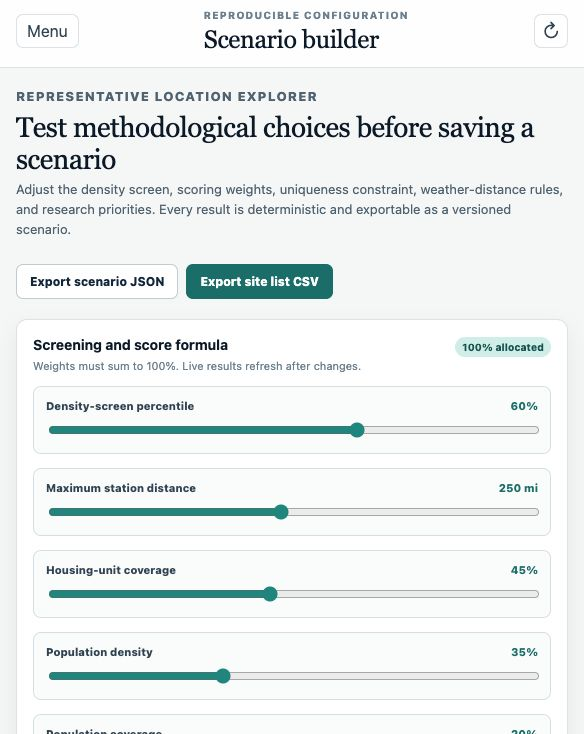
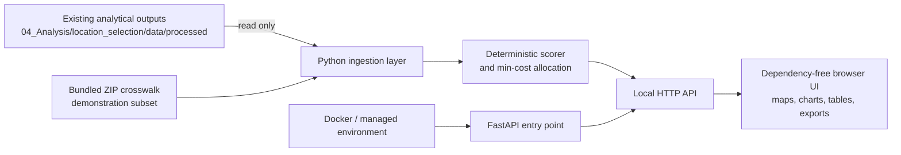

# Representative Location Explorer

[](https://github.com/hampochimacyril/Location-representation-explorer/actions/workflows/ci.yml)

**Live demo (synthetic data):** https://representative-location-explorer.onrender.com

Representative Location Explorer is a private research decision-support application for
selecting and comparing representative U.S. locations for national building-stock and
heat-health simulations. It wraps the existing location-selection analysis as read-only
inputs and makes the method inspectable through maps, rankings, scenario controls,
exports, and a transparent ZIP-code entry flow.

The application does **not** publish the private analytical data and does **not** treat
ZIP codes, ZCTAs, counties, CBSAs, places, and weather stations as interchangeable. The
public demo above serves only the bundled **synthetic** dataset (`data/demo/`); the real
processed outputs are never deployed.

## Current Capabilities

- Overview dashboard for 20 climate-region × urbanicity strata
- Interactive target-catchment and weather-station map
- ZIP-code explorer with ZCTA, county, CBSA, uncertainty, and filter-scope context
- Configurable density screen, score weights, uniqueness rule, station-distance rules,
  weather-QC eligibility, and editable research-priority override
- Candidate ranking table with filters, keyboard-operable sorting, CSV export, comparison, and scatter plot
- Allocation comparison with score differences, substitution reasons, and coverage-efficiency diagnostics
- Exact baseline ResStock filter fields and enumeration-verified values
- Versioned scenario JSON and site-list CSV exports
- Read-only ingestion manifest with SHA-256 fingerprints
- Fault-tolerant startup with a `/api/health` readiness probe and same-origin security headers
- Accessible UI: keyboard navigation, visible focus, `aria-sort`, reduced-motion support, and a print stylesheet

## Screenshots

Private PR screenshots are included for collaborator review:

| Overview | ZIP Explorer | Scenario Builder |
| --- | --- | --- |
|  |  |  |

Do not place screenshots containing restricted data in a public location.

## Architecture



The browser UI is deliberately dependency-free so it runs immediately in the controlled
research workspace. For managed environments, `backend/fastapi_app.py` exposes the same
service through FastAPI with Pydantic request validation. `backend/server.py` is the
zero-install local runner. `package.json` and `playwright.config.ts` define the managed
Node-based critical-flow test path for environments with `npm` available.

## Data Inputs

The service reads these existing outputs without modifying them:

```text
../../location_selection/data/processed/candidate_scores.csv
../../location_selection/data/processed/selected_locations.csv
../../location_selection/data/processed/resstock_site_list.csv
../../location_selection/data/processed/stratum_status.csv
../../location_selection/data/processed/selection_metadata.json
```

The bundled `data/zip_crosswalk_demo.csv` is a small demonstration subset with a
HUD-USPS-compatible schema. Replace it with a documented quarterly crosswalk ingestion
before using ZIP search nationally.

### Demonstration dataset (offline / CI / reviewers)

When the real processed outputs above are not present, the service automatically
falls back to a bundled **synthetic** dataset in `data/demo/` so the app and the
full test suite run on any clone with no external inputs. The data mode is shown
in `/api/health` (`"data_mode": "demo"`), in the methodology sources, and as a
"Demonstration dataset" indicator in the UI. Regenerate it deterministically with:

```bash
python3 scripts/generate_demo_data.py
```

Resolution order: an explicit `RLE_ANALYSIS_DATA_DIR` override (used verbatim) →
the real processed outputs if present → the bundled demo dataset. The demo numbers
are illustrative only and must never substitute for the real analytical outputs.

## Run Locally

From this application folder:

```bash
python3 -m backend.server
```

Open [http://127.0.0.1:8787](http://127.0.0.1:8787).

For a managed FastAPI environment:

```bash
python3 -m venv .venv
source .venv/bin/activate
pip install -r backend/requirements.txt
uvicorn backend.fastapi_app:app --reload --port 8787
```

### Health and graceful degradation

Inputs are loaded lazily, so the server starts even when the read-only analysis
directory is not yet mounted. Check readiness at any time:

```bash
curl http://127.0.0.1:8787/api/health
```

A ready instance reports `"data_ready": true` with candidate counts; otherwise it
reports `"status": "degraded"` and API calls return `503` with remediation
guidance instead of crashing. Override the input location with the
`RLE_ANALYSIS_DATA_DIR` environment variable when needed. Both entry points send
a strict same-origin Content-Security-Policy and standard hardening headers.

## Refresh Read-Only Inputs

After regenerating the analytical outputs:

```bash
python3 scripts/refresh_data.py
```

The command validates required files and writes `data/analysis_manifest.json` with
row counts and SHA-256 fingerprints. The manifest is intentionally ignored by Git
because it contains a local absolute path.

## Test

The suite is self-contained: with no real inputs present it runs against the
bundled demonstration dataset, so a fresh clone passes immediately.

```bash
python3 -m unittest discover -s tests -v
node --check frontend/app.js
python3 -m py_compile backend/*.py scripts/*.py tests/*.py
```

In a Node environment with `npm` available (Playwright launches the server itself):

```bash
npm install
npm run test:e2e
```

Continuous integration runs all of the above on every push and pull request via
[`.github/workflows/ci.yml`](.github/workflows/ci.yml) (Python 3.11/3.12 backend
tests, a graceful-degradation smoke test, frontend syntax, and Playwright e2e).

The regression suite checks:

- exactly 20 strata and one selection per stratum
- 20 distinct catchments when uniqueness is enabled
- rural `in.county` filters
- non-rural `in.metropolitan_and_micropolitan_statistical_area` filters
- enumeration-verified baseline filter values
- no research-priority override applied by default
- leading-zero identifier preservation
- transparent ZIP-resolution errors

## Deploy a public demo (Render)

The bundled [`render.yaml`](render.yaml) blueprint deploys a **public, demo-data**
instance — safe to share because it never serves the private analytical outputs.

1. Push the repository to GitHub.
2. In Render: **New → Blueprint**, connect this repo, and accept the detected
   `render.yaml`. Render builds, runs `scripts/generate_demo_data.py`, and starts
   `uvicorn backend.fastapi_app:app` on its `$PORT`.
3. After ~3–5 minutes you get a public URL like
   `https://representative-location-explorer.onrender.com`. Confirm readiness at
   `/api/health` (`"data_mode": "demo"`).

A `Procfile` is included for Heroku/Railway-style platforms, and the `Dockerfile`
honors `$PORT` for any container host. To serve **real** data instead, deploy to a
private/authenticated host and set `RLE_ANALYSIS_DATA_DIR` to a read-only mount.

**Free-tier cold starts:** Render's free web services sleep after ~15 minutes idle,
so the first request then takes ~30–60s to wake. To keep the demo warm at no cost,
point a free uptime monitor (e.g. UptimeRobot or cron-job.org) at `…/api/health`
every 10 minutes.

## Docker

```bash
# Demo data (no mount needed):
docker build -t rle . && docker run -p 8787:8787 rle

# Real data, mounted read-only:
docker compose up --build
```

`docker-compose.yml` mounts the existing processed analysis directory read-only.
Review [docs/deployment_options.md](docs/deployment_options.md) before any private
deployment.

## Private GitHub Publication

Confirmed private repository:
[hampochimacyril/Location-representation-explorer](https://github.com/hampochimacyril/Location-representation-explorer)

Active branch:

```bash
feature/location-representation-explorer
```

Draft pull request:
[#1 Add Representative Location Explorer](https://github.com/hampochimacyril/Location-representation-explorer/pull/1)

Review [docs/privacy_and_repository_rules.md](docs/privacy_and_repository_rules.md) before
adding collaborators, screenshots, deployment targets, or any additional data artifacts.

## Known Limitations

- ZIP search currently uses a transparent demonstration subset, not a national
  HUD-USPS refresh.
- The baseline analysis uses boundary-consistent 2010 Census tract inputs.
- Hourly temperature and humidity completeness is a separate pre-simulation QC step.
- New scenario alternatives remain marked `REVIEW REQUIRED` until an exact ResStock
  enumeration mapping is curated and verified.
- The map shows catchment centroids, not full tract or CBSA polygons.
