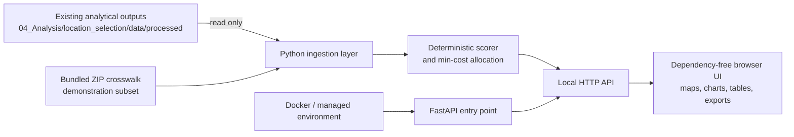

# Representative Location Explorer

Representative Location Explorer is a private research decision-support application for
selecting and comparing representative U.S. locations for national building-stock and
heat-health simulations. It wraps the existing location-selection analysis as read-only
inputs and makes the method inspectable through maps, rankings, scenario controls,
exports, and a transparent ZIP-code entry flow.

The application does **not** publish data, deploy a public service, or treat ZIP codes,
ZCTAs, counties, CBSAs, places, and weather stations as interchangeable.

## Current Capabilities

- Overview dashboard for 20 climate-region × urbanicity strata
- Interactive target-catchment and weather-station map
- ZIP-code explorer with ZCTA, county, CBSA, uncertainty, and filter-scope context
- Configurable density screen, score weights, uniqueness rule, station-distance rules,
  weather-QC eligibility, and editable research-priority override
- Candidate ranking table with filters, sorting, CSV export, comparison, and scatter plot
- Allocation comparison with score differences and substitution reasons
- Exact baseline ResStock filter fields and enumeration-verified values
- Versioned scenario JSON and site-list CSV exports
- Read-only ingestion manifest with SHA-256 fingerprints

## Screenshots

Private PR screenshots are included for collaborator review:

| Overview | ZIP Explorer | Scenario Builder |
| --- | --- | --- |
|  |  |  |

Do not place screenshots containing restricted data in a public location.

## Architecture



The browser UI is deliberately dependency-free so it runs immediately in the controlled
research workspace. For managed environments, `backend/fastapi_app.py` exposes the same
service through FastAPI with Pydantic request validation. `backend/server.py` is the
zero-install local runner. `package.json` and `playwright.config.ts` define the managed
Node-based critical-flow test path for environments with `npm` available.

## Data Inputs

The service reads these existing outputs without modifying them:

```text
../../location_selection/data/processed/candidate_scores.csv
../../location_selection/data/processed/selected_locations.csv
../../location_selection/data/processed/resstock_site_list.csv
../../location_selection/data/processed/stratum_status.csv
../../location_selection/data/processed/selection_metadata.json
```

The bundled `data/zip_crosswalk_demo.csv` is a small demonstration subset with a
HUD-USPS-compatible schema. Replace it with a documented quarterly crosswalk ingestion
before using ZIP search nationally.

## Run Locally

From this application folder:

```bash
python3 -m backend.server
```

Open [http://127.0.0.1:8787](http://127.0.0.1:8787).

For a managed FastAPI environment:

```bash
python3 -m venv .venv
source .venv/bin/activate
pip install -r backend/requirements.txt
uvicorn backend.fastapi_app:app --reload --port 8787
```

## Refresh Read-Only Inputs

After regenerating the analytical outputs:

```bash
python3 scripts/refresh_data.py
```

The command validates required files and writes `data/analysis_manifest.json` with
row counts and SHA-256 fingerprints. The manifest is intentionally ignored by Git
because it contains a local absolute path.

## Test

```bash
python3 -m unittest discover -s tests -v
node --check frontend/app.js
python3 -m py_compile backend/*.py scripts/*.py tests/*.py
```

In a Node environment with `npm` available:

```bash
npm install
npm run test:e2e
```

The regression suite checks:

- exactly 20 strata and one selection per stratum
- 20 distinct catchments when uniqueness is enabled
- rural `in.county` filters
- non-rural `in.metropolitan_and_micropolitan_statistical_area` filters
- enumeration-verified baseline filter values
- Philadelphia preference behavior
- leading-zero identifier preservation
- transparent ZIP-resolution errors

## Docker

```bash
docker compose up --build
```

`docker-compose.yml` mounts the existing processed analysis directory read-only.
Review [docs/deployment_options.md](docs/deployment_options.md) before any private
deployment.

## Private GitHub Publication

Confirmed private repository:
[hampochimacyril/Location-representation-explorer](https://github.com/hampochimacyril/Location-representation-explorer)

Active branch:

```bash
feature/location-representation-explorer
```

Draft pull request:
[#1 Add Representative Location Explorer](https://github.com/hampochimacyril/Location-representation-explorer/pull/1)

Review [docs/privacy_and_repository_rules.md](docs/privacy_and_repository_rules.md) before
adding collaborators, screenshots, deployment targets, or any additional data artifacts.

## Known Limitations

- ZIP search currently uses a transparent demonstration subset, not a national
  HUD-USPS refresh.
- The baseline analysis uses boundary-consistent 2010 Census tract inputs.
- Hourly temperature and humidity completeness is a separate pre-simulation QC step.
- New scenario alternatives remain marked `REVIEW REQUIRED` until an exact ResStock
  enumeration mapping is curated and verified.
- The map shows catchment centroids, not full tract or CBSA polygons.
